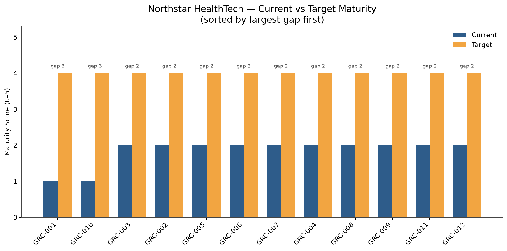
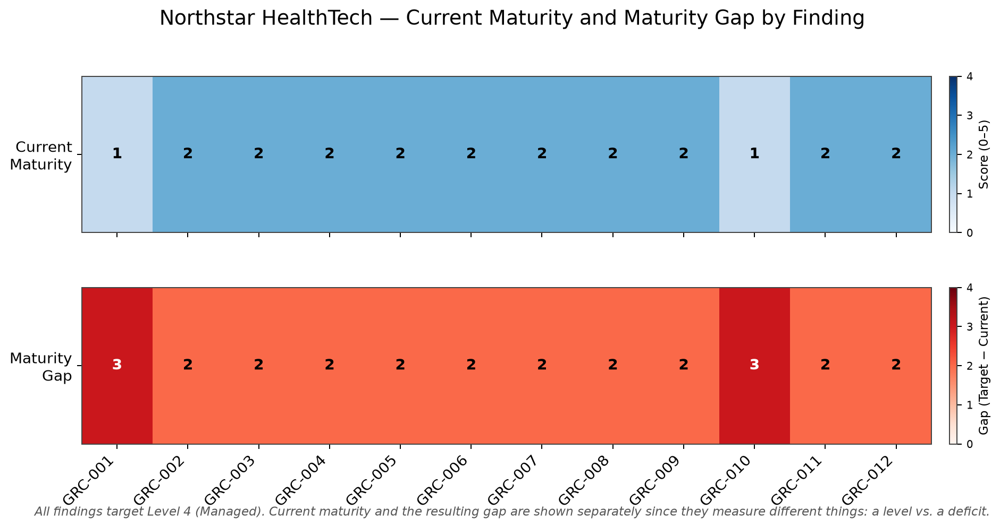
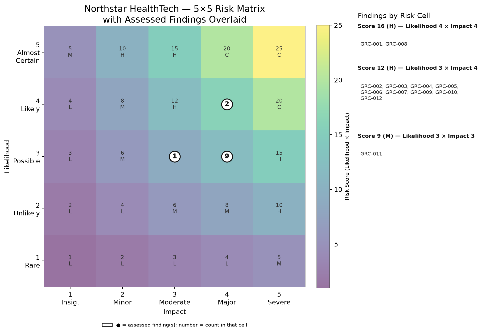

# NIST CSF 2.0 Cybersecurity Gap Assessment

Evidence-driven governance, risk, and compliance portfolio project using **NIST Cybersecurity Framework 2.0** to assess a fictional mid-sized healthcare technology organization, identify control gaps, score maturity, translate findings into business risk, and produce an executive remediation roadmap.

> **Case-study organization:** Northstar HealthTech is entirely fictional. No findings in this repository represent a real employer, customer, or production environment.

---

## Project Overview

This project demonstrates how technical cybersecurity observations can be translated into governance findings, NIST CSF 2.0 control mappings, evidence-based maturity scores, business-oriented risk statements, a formal risk register, remediation priorities, executive reporting, and reproducible security visuals.

The assessment covers the six NIST CSF 2.0 Functions:

```text
GOVERN
IDENTIFY
PROTECT
DETECT
RESPOND
RECOVER
```

The central assessment theme is:

> **Technical capability is ahead of governance maturity.**

Northstar HealthTech has meaningful security technology and operational capability, but several supporting governance processes remain informal, inconsistently documented, insufficiently measured, or weakly tested.

---

# Executive Snapshot

| Metric | Result |
|---|---:|
| Findings assessed | **12** |
| Average current maturity | **1.83 / 5** |
| Average target maturity | **4.00 / 5** |
| Average maturity gap | **2.17** |
| Critical risks | **0** |
| High risks | **11** |
| Medium risks | **1** |
| Low risks | **0** |

---

## Maturity Overview



The largest maturity gaps are:

| Finding | Current | Target | Gap |
|---|---:|---:|---:|
| GRC-001 — Cybersecurity Risk Management Strategy | 1 | 4 | **3** |
| GRC-010 — Incident Response Exercises and Testing | 1 | 4 | **3** |

Most other capabilities currently operate at **Level 2 — Developing**, with a target state of **Level 4 — Managed**.

---

## Maturity Heatmap



---

# Risk Profile

```text
Critical   0
High      11
Medium     1
Low        0
Total     12
```



Risk is assessed separately from maturity using a **5×5 likelihood × impact model**.

```text
Maturity
“How mature is the control?”

Risk
“How much business exposure does the gap create?”
```

A low maturity score does not automatically create a critical risk, and a moderate maturity gap may still produce high risk when privileged access, sensitive data, critical systems, or exploitable exposure are involved.

---

# Assessment Findings

| ID | Finding | NIST CSF 2.0 | Current | Target | Risk |
|---|---|---|---:|---:|---|
| GRC-001 | Cybersecurity Risk Management Strategy Not Formally Established | GV.RM | 1 | 4 | High |
| GRC-002 | Cybersecurity Roles, Responsibilities, and Authorities Incompletely Defined | GV.RR | 2 | 4 | High |
| GRC-003 | Third-Party Cybersecurity Risk Reviews Are Inconsistent | GV.SC | 2 | 4 | High |
| GRC-004 | Excessive and Stale Privileged Access | PR.AA | 2 | 4 | High |
| GRC-005 | Privileged Access Reviews Are Not Performed on a Formal Recurring Basis | PR.AA | 2 | 4 | High |
| GRC-006 | Asset Inventory Is Incomplete | ID.AM | 2 | 4 | High |
| GRC-007 | Security Logging and Monitoring Coverage Is Incomplete | DE.CM | 2 | 4 | High |
| GRC-008 | Vulnerability Remediation SLAs Are Not Formally Defined | ID.RA / PR.PS | 2 | 4 | High |
| GRC-009 | Incident Response Procedures Are Incompletely Formalized | RS | 2 | 4 | High |
| GRC-010 | Incident Response Exercises and Testing Are Immature | RS / RC | 1 | 4 | High |
| GRC-011 | Post-Incident Lessons-Learned Process Is Inconsistent | ID.IM | 2 | 4 | Medium |
| GRC-012 | Recovery Procedures Are Insufficiently Tested | RC | 2 | 4 | High |

Detailed evidence, scoring rationale, risk implications, remediation actions, validation criteria, and risk-register candidates are documented in the individual finding files.

---

# Evidence-First Assessment Method

Maturity scores were not selected first and justified afterward.

Each finding follows:

```text
Evidence
    ↓
Observed Control State
    ↓
Scoring Rationale
    ↓
Current Maturity
    ↓
Target Maturity
    ↓
Maturity Gap
    ↓
Business Risk
    ↓
Recommendation
    ↓
Validation Criteria
```

This keeps the assessment traceable and reduces arbitrary scoring.

---

## Maturity Scale

| Score | Level | Definition |
|---:|---|---|
| 0 | Not Implemented | No meaningful evidence that the control exists |
| 1 | Initial | Ad hoc, informal, reactive, or inconsistently performed |
| 2 | Developing | Partially implemented with incomplete coverage or documentation |
| 3 | Defined | Documented and consistently implemented |
| 4 | Managed | Measured, monitored, governed, and routinely reviewed |
| 5 | Optimized | Continuously improved using metrics, automation, lessons learned, or advanced governance |

> NIST CSF 2.0 does not prescribe this 0–5 maturity scale. It is used here as a portfolio assessment mechanism for structured comparison and executive communication.

---

# Risk Scoring

The risk model uses:

```text
Inherent Risk Score = Likelihood × Impact
```

| Score | Rating |
|---:|---|
| 1–4 | Low |
| 5–9 | Medium |
| 10–16 | High |
| 17–25 | Critical |

Residual risk is reassessed after considering existing controls rather than reduced through arbitrary percentage calculations.

See:

- [`docs/risk-scoring-methodology.md`](docs/risk-scoring-methodology.md)
- [`reports/risk-register.md`](reports/risk-register.md)

---

# Top Executive Risks

## 1. Cybersecurity Risk Governance

Northstar HealthTech performs technical security activity but lacks a formally approved enterprise cybersecurity risk-management strategy.

**Primary issue:** no consistently governed risk objectives, appetite/tolerance, ownership, escalation, or executive review cadence.

**Related finding:** `GRC-001`

---

## 2. Privileged Access Governance

Technical evidence shows broad permissions, wildcard scope, and stale entitlements while recurring privileged-access recertification remains immature.

**Business concern:** compromised privileged identities could have a larger impact than necessary.

**Related findings:** `GRC-004`, `GRC-005`

---

## 3. Security Monitoring Coverage

Windows, endpoint, authentication, and AWS telemetry exist, but coverage is incomplete.

A modeled AWS case demonstrated that S3 object-level `GetObject` activity was not visible until CloudTrail data-event logging was explicitly enabled.

**Business concern:** important malicious activity may occur without sufficient detection or forensic evidence.

**Related finding:** `GRC-007`

---

## 4. Vulnerability Remediation Governance

Vulnerabilities can be identified and remediated, but formal risk-based remediation SLAs, escalation thresholds, and exception governance are not mature.

**Business concern:** known weaknesses may remain exploitable longer than acceptable.

**Related finding:** `GRC-008`

---

## 5. Incident Response and Recovery Assurance

Technical investigation capability exists, but incident response procedures, exercises, and recovery testing remain immature.

**Business concern:** response or restoration may fail under pressure despite technical capability.

**Related findings:** `GRC-009`, `GRC-010`, `GRC-012`

---

# Technical-to-Governance Crosswalk

| GRC Finding | Supporting Technical Evidence |
|---|---|
| GRC-004 | AWS excessive permissions, wildcard scope, stale permissions |
| GRC-005 | IAM entitlement findings demonstrate need for recurring recertification |
| GRC-007 | AWS CloudTrail S3 data-event visibility gap and Detection-as-Code telemetry dependencies |
| GRC-009 | SOC investigation workflows demonstrate technical incident-analysis capability |
| GRC-010 | Detection and SOC scenarios provide realistic exercise material |
| GRC-011 | Logging remediation demonstrates how technical lessons become governance improvements |

The analytical progression is:

```text
Technical Observation
        ↓
Control Weakness
        ↓
Governance Gap
        ↓
Business Risk
        ↓
Remediation Recommendation
```

---

# 90-Day Improvement Roadmap

## Days 0–30 — Establish Governance and Visibility

- assign an executive cybersecurity sponsor;
- approve interim cybersecurity risk objectives;
- assign owners to all assessment risks;
- establish a formal risk register;
- identify critical assets;
- identify privileged identities;
- remove clearly stale or excessive privilege;
- identify critical logging gaps;
- define interim vulnerability-remediation targets;
- establish incident escalation contacts.

## Days 31–60 — Standardize Core Processes

- develop cybersecurity RACI;
- establish privileged-access review procedures;
- create authoritative asset inventory;
- publish logging and monitoring requirements;
- define vulnerability-remediation SLAs;
- approve incident severity and escalation model;
- formalize incident response plan;
- define recovery priorities and provisional RTO/RPO values.

## Days 61–90 — Validate and Measure

- perform first privileged-access recertification;
- validate critical log-source coverage;
- conduct first formal incident-response tabletop;
- test restoration of critical data or an application;
- establish third-party risk tiering;
- launch cybersecurity metrics;
- track corrective actions from exercises and reviews.

---

# Recommended Remediation Waves

## Wave 1 — Governance and Visibility

- GRC-001 — Cybersecurity Risk Strategy
- GRC-002 — Roles and Responsibilities
- GRC-006 — Asset Inventory

**Goal:** define ownership, governance, and what must be protected.

## Wave 2 — Identity and Exposure Reduction

- GRC-004 — Excessive and Stale Privileged Access
- GRC-005 — Privileged Access Reviews
- GRC-008 — Vulnerability Remediation SLAs

**Goal:** reduce preventable attack surface and known exposure.

## Wave 3 — Detection and Response

- GRC-007 — Logging and Monitoring
- GRC-009 — Incident Response Formalization
- GRC-010 — Incident Response Exercises

**Goal:** improve visibility, response consistency, and operational assurance.

## Wave 4 — Resilience and External Risk

- GRC-012 — Recovery Testing
- GRC-003 — Third-Party Risk
- GRC-011 — Lessons Learned

**Goal:** strengthen recovery, supplier resilience, and continuous improvement.

---

# Repository Structure

```text
NIST-CSF-2.0-Gap-Assessment/
│
├── README.md
│
├── docs/
│   ├── organization-profile.md
│   ├── assessment-scope.md
│   ├── maturity-scoring-methodology.md
│   ├── risk-scoring-methodology.md
│   └── assumptions-and-limitations.md
│
├── findings/
│   ├── GRC-001-risk-management-strategy.md
│   ├── GRC-002-roles-responsibilities-authorities.md
│   ├── GRC-003-third-party-cybersecurity-risk.md
│   ├── GRC-004-excessive-stale-privileged-access.md
│   ├── GRC-005-privileged-access-reviews.md
│   ├── GRC-006-incomplete-asset-inventory.md
│   ├── GRC-007-incomplete-security-logging-monitoring.md
│   ├── GRC-008-vulnerability-remediation-slas.md
│   ├── GRC-009-incident-response-formalization.md
│   ├── GRC-010-incident-response-exercises-testing.md
│   ├── GRC-011-post-incident-lessons-learned.md
│   └── GRC-012-recovery-procedures-testing.md
│
├── reports/
│   ├── executive-summary.md
│   ├── detailed-gap-assessment.md
│   └── risk-register.md
│
├── visuals/
│   ├── maturity-by-finding.png
│   ├── maturity-heatmap.png
│   └── risk-matrix.png
│
├── scripts/
│   └── generate_visuals.py
│
└── data/
    └── supporting working files
```

---

# Key Deliverables

## Executive Summary

[`reports/executive-summary.md`](reports/executive-summary.md)

Designed for a business or leadership audience.

## Detailed Gap Assessment

[`reports/detailed-gap-assessment.md`](reports/detailed-gap-assessment.md)

Provides the consolidated evidence summary, NIST mapping, maturity, gap, risk, and remediation view.

## Risk Register

[`reports/risk-register.md`](reports/risk-register.md)

Consolidates all 12 assessment risks using the project-wide likelihood-and-impact model.

## Individual Findings

[`findings/`](findings/)

Each finding contains:

- finding summary;
- NIST CSF mapping;
- current-state evidence;
- observed control state;
- scoring rationale;
- current and target maturity;
- maturity gap;
- business risk;
- recommended remediation;
- implementation roadmap;
- validation criteria;
- risk-register candidate.

---

# Reproducible Visuals

The maturity charts and risk matrix are generated with Python rather than manually exported from a spreadsheet.

Run:

```bash
python scripts/generate_visuals.py
```

This regenerates:

```text
visuals/maturity-by-finding.png
visuals/maturity-heatmap.png
visuals/risk-matrix.png
```

This keeps the executive visuals reproducible and version-controlled.

---

# Skills Demonstrated

### Governance, Risk, and Compliance

- NIST CSF 2.0
- gap assessments
- maturity assessment
- risk registers
- likelihood and impact scoring
- risk treatment
- executive reporting
- remediation roadmaps
- evidence-based control assessment

### Cybersecurity Consulting

- current-state assessment
- target-state definition
- control-gap analysis
- findings development
- business-risk translation
- prioritization
- stakeholder-focused reporting

### Security Operations

- logging and monitoring
- incident response
- vulnerability management
- asset management
- identity and access governance
- recovery assurance

### Technical Validation

- AWS IAM and CloudTrail
- Windows security telemetry
- detection engineering
- SOC investigation workflows
- Python-generated reporting visuals

---

# Assessment Principles

### Evidence before score

```text
Evidence → Rationale → Maturity
```

### Risk is separate from maturity

```text
Control maturity ≠ Business risk
```

### Technical controls require governance

```text
Technology
+
Ownership
+
Process
+
Measurement
+
Validation
```

### Recommendations must be testable

Every material finding includes validation criteria so remediation can be independently verified.

---

# Limitations

This project is a portfolio simulation.

It does **not** represent:

- an official NIST assessment;
- a certification;
- a compliance attestation;
- a legal opinion;
- an audit of a real organization;
- a real healthcare environment.

The maturity and risk models are analytical tools used to demonstrate structured cybersecurity assessment methodology.

---

# Project Outcome

The final assessment concludes that Northstar HealthTech possesses useful technical security capability but lacks the governance maturity required to operate those capabilities consistently and measurably at enterprise scale.

The recommended target state is not simply “more security technology.”

It is:

```text
Clear Governance
        +
Defined Ownership
        +
Risk-Based Controls
        +
Measurable Execution
        +
Continuous Validation
        +
Executive Visibility
```

That transition—from technical findings to business risk and structured remediation—is the core purpose of this project.
